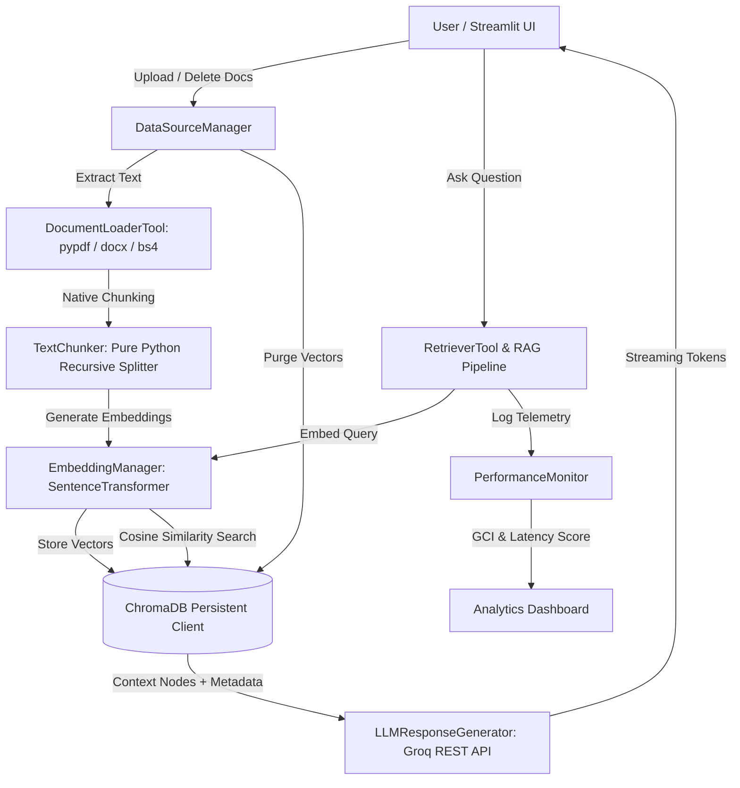

# 🧠 Adaptive RAG Knowledge Assistant
### *Real-Time Data Source Control, Native Vector Store & RAG Performance Telemetry*

[](https://rag-adaptive.streamlit.app/)
[](https://python.org)
[](https://streamlit.io)
[](https://python.org)
[](https://trychroma.com)
[](https://groq.com)

🚀 **Live App**: [https://rag-adaptive.streamlit.app/](https://rag-adaptive.streamlit.app/)


An end-to-end, production-grade **Retrieval-Augmented Generation (RAG)** system built **100% from scratch in native Python without high-level frameworks like LangChain**. Features dynamic document ingestion, true vector store purging on source deletion, native SentenceTransformer embeddings, ChromaDB persistent vector search, and real-time Grounding Confidence Index (GCI) telemetry.

---

## 🌟 Key Features

- ⚡ **100% Native Architecture**: Built completely from scratch without LangChain, LlamaIndex, or high-level wrappers.
- 📄 **Multi-Format & Scanned Document Ingestion**: Native text extraction for **both Digital & Scanned Image PDFs** (`pypdf` + `pdfplumber` + `pytesseract` OCR), Word (`python-docx`), TXT, and Web Endpoints (`BeautifulSoup4`).
- 👁️ **Automatic OCR Fallback**: Built-in Optical Character Recognition pipeline parses non-selectable, image-based, and scanned PDF documents seamlessly.
- ☁️ **Cloud Supabase Vector Engine**: Production-grade cloud vector database powered by PostgreSQL `pgvector` with cosine similarity search and real-time remote document sync.
- ✂️ **Native Recursive Text Chunker**: Custom sliding window text splitter algorithm with configurable overlap and sentence boundary preservation.
- 🗑️ **True Vector Store Deletion**: Deleting a document from the UI purges its database records and deletes all corresponding vector embeddings from Supabase Cloud.
- ⚡ **Direct Groq LPU Inference**: Direct REST API integration with **Groq API** (`llama-3.3-70b-versatile`, `mixtral-8x7b-32768`) supporting streaming tokens.
- 📐 **Local Dense Embeddings**: `SentenceTransformer` vectorizers (`all-MiniLM-L6-v2`, `bge-small-en-v1.5`) running locally with zero external network latency.
- 📊 **Telemetry Analytics**: Real-time Grounding Confidence Index (GCI) scoring, latency logging, and vector source distribution charts.
- 🎨 **Executive UI**: Light executive aesthetic with `2.5px` solid charcoal borders, vector SVG icons, and a 4-tab workbench.


---

## 🏗️ Architecture Workflow



---

## 📁 Repository Structure

```text
Adaptive-RAG/
├── data/                       # Local data storage (vector DBs, uploaded docs, registry)
│   ├── chroma_db/              # Persistent ChromaDB vector database
│   ├── documents/              # Stored uploaded files
│   ├── active_docs.json        # Active document registry
│   └── performance_logs.json   # Query evaluation logs
├── ingestion/                  # Native document loaders, chunking & registry
│   ├── loaders.py              # PDF, DOCX, TXT, Web URL native extractors
│   ├── chunker.py              # Pure Python recursive text splitter
│   └── source_manager.py       # Registry & vector purge coordinator
├── embeddings/                 # Native SentenceTransformer embedding model wrapper
│   └── manager.py
├── vectordb/                   # Native ChromaDB persistent client adapter
│   └── vector_store.py
├── generator/                  # Retrieval, system prompts & Groq API LLM client
│   ├── retriever.py            # Semantic similarity search with distance thresholding
│   ├── prompts.py              # Context-grounded anti-hallucination prompts
│   └── llm.py                  # Native Groq REST API client & streaming engine
├── evaluation/                 # Telemetry & GCI evaluation
│   └── performance_monitor.py # GCI confidence evaluator & event logger
├── ui/                         # Executive design system & Streamlit interface
│   ├── styles.py               # Executive light design system & CSS tokens
│   ├── app.py                  # Streamlit 4-tab executive interface
│   └── screenshot/ui.PNG       # Interface screenshot
├── tests/                      # Pytest unit testing suite
│   ├── test_ingestion.py       # Ingestion & chunker unit tests
│   ├── test_vectordb.py        # ChromaDB vector store tests
│   └── test_evaluation.py     # GCI telemetry evaluation tests
├── config.py                   # Global system parameters & model defaults
├── .env.example                # Sample environment variables
├── requirements.txt            # Python dependencies
└── README.md                   # Project documentation
```

---

## 🛠️ Quickstart & Installation

### 1. Clone the Repository
```bash
git clone https://github.com/Abdullah-Zafarr/Adaptive-RAG.git
cd Adaptive-RAG
```

### 2. Install Dependencies
```bash
pip install -r requirements.txt
```

### 3. Set Up Environment Variables
Create a `.env` file in the root directory:
```env
GROQ_API_KEY=your_groq_api_key_here
```

### 4. Run the Application
```bash
streamlit run ui/app.py
```

Open `http://localhost:8501` in your browser.

---

## 🧪 Running Unit Tests

Run the test suite using `pytest`:
```bash
pytest tests/
```

---

## 📜 License
MIT License. Created by Abdullah Zafar.
